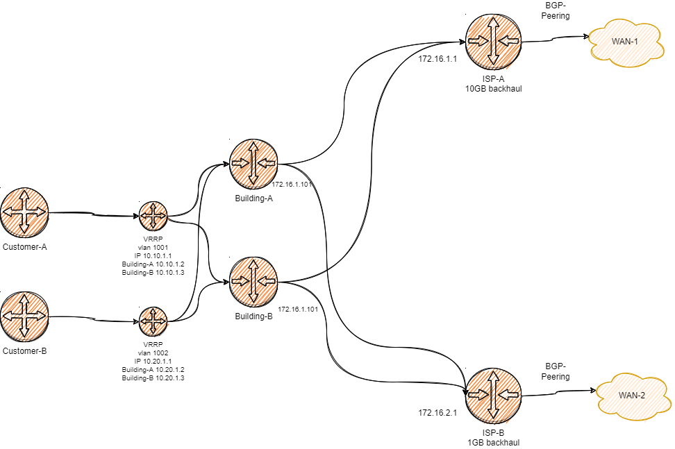

# Network Engineer Test

Given above scenario.
Please create Mikrotik's configuration for below routers in respective files:

- ISP-A: `isp-a.rsc`
- ISP-B: `isp-b.rsc`
- Building A: `building-a.rsc`
- Building B: `building-a.rsc`

## Must use technologies

1. `BGP Peering` on `ISP-A` and `ISP-B` routers.

2. `MPLS Internal` peering to find best path between `buildings` and `ISP Gateways`.

3. `VRRP` to allow customer to route through backup router.

4. `Graylog` Create a docker-compose that boots Mikrotik [example](https://github.com/Graylog2/docker-compose/tree/main/cluster)

5. `ntopng` Route traffic flows to `ntop` docker-compose service [example](https://github.com/frostasm/ntopng-docker)

## Submit your result

Please clone this repository in a new github repository in private mode and share with ID: mason-chase in private mode on github.com
